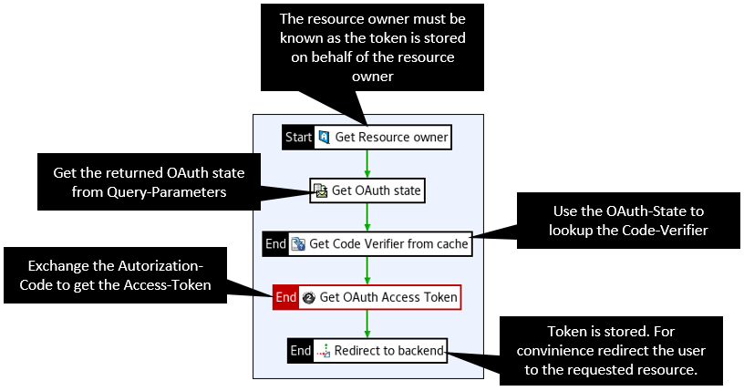

# OAuth PKCE

If the Axway API Gateway/API Management should be used to access an OAuth protected resource on behalf of a user, it must obtain an OAuth access token from the appropriate authorization server on behalf of the user. The OAuth authorization code flow is used for this purpose.
More precisely, the API gateway obtains an OAuth access token from a 3rd party authorization on behalf of a user, i.e. the resource owner, and uses it to access the resource on behalf of the user.  

For security reasons, however, it may be necessary to use the PKCE flow for this requirement. The OAuth PKCE flow is an extension of the OAuth authorization code flow. The difference is that the authorization request is not performed with the application Client-ID and Secret, but with a code challenge. 
This code challenge is generated by the client based on a code verifier. Then this code challenge is stored by the authorization server and compared later with the code verifier when the authorization code should be exchanged for the access token. You can more in the official specification: https://datatracker.ietf.org/doc/html/rfc7636.  

Since the API gateway in this use case is the client, it must generate as the code challenge & code verifier and send along accordingly in the authorization redirect and token exchange.  

## API-Gateway setup

### Get or Retrieve OAuth-Access-Token

The following policy shows how such a protection can look like and how the API gateway gets a token for the runtime or obtains it from the token store:  

  

### Callback policy

The callback policy is bound to an endpoint (e.g. `/oauth/callback`) to exchange the received authorization code for an access token. Additionally, on callback, the state passed in the authorization request is received again and used to load the code verifier from the cache. The Code-Verifier is required for the Token-Request.  

  

### OAuth-Client application

Also for the PKCE Flow, an OAuth client application must be set up in the API gateway using Policy-Studio, analogous to the Authorization-Code Flow. In addition to the standard setup, some parameters have to be added. The names of the variables in the following example are matched to the scripting snippets.  

  

:point_up: There may be an error with the token exchange if, for example, if you are using Azure-AD. In this case, check the use of the special AzureOAuth2TokenProvider.

### Create Code-Challenge

This scripting code defines the attributes `code_challenge`, `code_challenge_method` and `code_verifier_key` and runs before the client is redirected towards the authorization server.  
The attribute `code_verifier_key` intentionally does not correspond to the attribute configured in the client app, since it should not be sent with the authorization request. Instead, it should be cached with the state as the key so that it can be used again in the callback.

```js
var imp = new JavaImporter(com.vordel.trace, java.security, java.util);
with(imp) {
    function invoke(msg) {
        var secureRandom = new SecureRandom();
        var codeVerifier = java.lang.reflect.Array.newInstance(java.lang.Byte.TYPE, 32);
        secureRandom.nextBytes(codeVerifier);
        codeVerifier = Base64.getUrlEncoder().withoutPadding().encodeToString(codeVerifier)
        Trace.info("Code verifier: " + codeVerifier);
        msg.put("code_verifier_key", codeVerifier);

        var messageDigest = MessageDigest.getInstance("SHA-256");
        var bytes = codeVerifier.getBytes("US-ASCII");
        messageDigest.update(bytes, 0, bytes.length);

        var codeChallenge = messageDigest.digest();
        codeChallenge = Base64.getUrlEncoder().withoutPadding().encodeToString(codeChallenge);
        Trace.info("Code Challenge: " + codeChallenge);
        msg.put("code_challenge", codeChallenge);
        msg.put("code_challenge_method", "S256");
        return true;
    }
};
```

### Get OAuth-State

This scripting filter is necessary to extract from the redirection location header, since it is not provided as an attribute by the API gateway. This state is then used to cache the code verifier.

```js
var imp = new JavaImporter(com.vordel.trace, java.net);
with(imp) {
    function invoke(msg) {
        var locationHeader = msg.get("http.headers").getHeader("Location");

        Trace.info("Location header: " + locationHeader);
        var url = new URL(locationHeader);
        var queryParams = url.getQuery();
        var params = queryParams.split("&");

	for(var i = 0; i < params.length; i++) {
		var param = params[i];
                var paramName = param.split("=")[0];
		if(paramName == "state") {
	                var paramValue = param.split("=")[1];
			msg.put("state", paramValue);
			break;
		}
	}
        return true;
    }
};
```

## API Management Version Compatibilty

This artefact has been tested with API-Management Versions

| Version            | Comment         |
| :---               | :---            |
| 7.7-20210530       |                 |
| 7.7-20210330       |                 |
| 7.7-20200930       |                 |

Please let us know, if you encounter any [issues](https://github.com/Axway-API-Management-Plus/azure-oauth2provider/issues) with your API-Manager version.  

## Contributing

Please read [Contributing.md](https://github.com/Axway-API-Management-Plus/Common/blob/master/Contributing.md) for details on our code of conduct, and the process for submitting pull requests to us.

## Team

![alt text][Axwaylogo] Axway Team

[Axwaylogo]: https://github.com/Axway-API-Management/Common/blob/master/img/AxwayLogoSmall.png  "Axway logo"


## License
[Apache License 2.0](/LICENSE)
